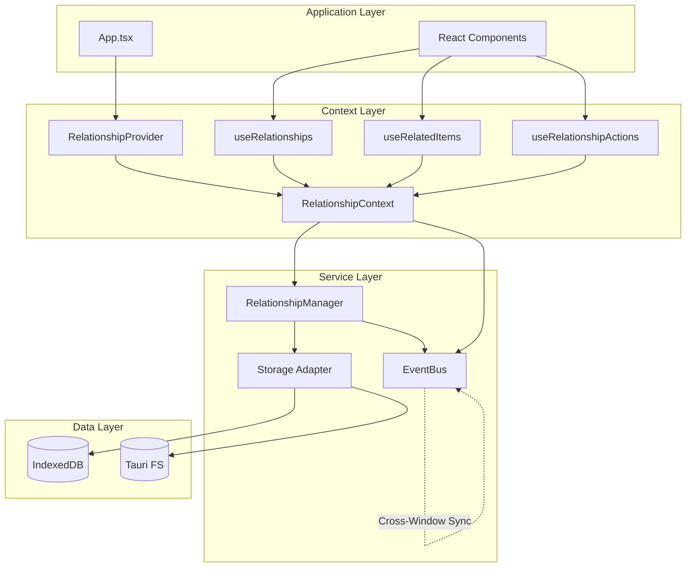
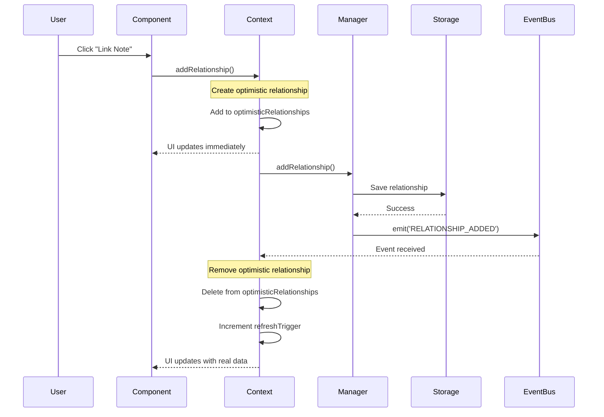

# Relationship Context Architecture

**Version**: 2.0.0
**Last Updated**: 2025-10-24
**Status**: Production-Ready

## Table of Contents

1. [Overview](#overview)
2. [Architecture Diagram](#architecture-diagram)
3. [Component Hierarchy](#component-hierarchy)
4. [State Flow](#state-flow)
5. [Optimistic Updates](#optimistic-updates)
6. [API Reference](#api-reference)
7. [Usage Examples](#usage-examples)
8. [Performance Considerations](#performance-considerations)
9. [Memory Management](#memory-management)
10. [Cross-Window Sync](#cross-window-sync)
11. [Integration Guide](#integration-guide)
12. [Troubleshooting](#troubleshooting)

---

## Overview

The Relationship Context provides a React-friendly wrapper around the `RelationshipManager` service, enabling:

- **Optimistic Updates**: Immediate UI feedback before server/storage confirmation
- **Event-Driven Reactivity**: Automatic updates when relationships change anywhere in the app
- **Type-Safe Operations**: Full TypeScript support with strict typing
- **Memory Leak Prevention**: Proper cleanup of event listeners and subscriptions
- **Cross-Window Sync**: Changes in one window/tab reflect in others

### Key Components

- **RelationshipContext**: React context holding relationship state
- **RelationshipProvider**: Provider component that wraps the app
- **useRelationships**: Hook for accessing relationship operations
- **useRelatedItems**: Hook for fetching related entities
- **useRelationshipActions**: Hook for entity-specific relationship actions

---

## Architecture Diagram



---

## Component Hierarchy

```
App
└── RelationshipProvider
    ├── State Management
    │   ├── optimisticRelationships: Map<string, Relationship>
    │   ├── isLoading: boolean
    │   ├── error: Error | null
    │   └── refreshTrigger: number
    │
    ├── RelationshipManager Instance
    │   ├── addRelationship()
    │   ├── removeRelationship()
    │   ├── getRelationships()
    │   └── getRelatedEntities()
    │
    └── Event Subscriptions
        ├── RELATIONSHIP_ADDED
        ├── RELATIONSHIP_REMOVED
        ├── RELATIONSHIP_UPDATED
        └── ENTITY_DELETED
```

---

## State Flow

### 1. Adding a Relationship



### 2. Optimistic Update Flow

```
User Action
    ↓
Generate optimistic ID
    ↓
Create optimistic relationship
    ↓
Add to optimisticRelationships Map
    ↓
Trigger re-render (UI shows immediately)
    ↓
Call manager.addRelationship()
    ↓
┌─ Success ───────────────┐   ┌─ Error ──────────────┐
│ Remove optimistic rel    │   │ Remove optimistic rel │
│ Real rel appears via     │   │ Set error state       │
│ RELATIONSHIP_ADDED event │   │ Throw error           │
└──────────────────────────┘   └───────────────────────┘
```

### 3. Event-Driven Updates

```
External Change (Another Component/Window)
    ↓
RelationshipManager.addRelationship()
    ↓
Storage.save()
    ↓
EventBus.emit('RELATIONSHIP_ADDED')
    ↓
RelationshipContext receives event
    ↓
Increment refreshTrigger
    ↓
useMemo/useCallback recalculate
    ↓
Components re-render with new data
```

---

## Optimistic Updates

Optimistic updates provide instant UI feedback before storage confirmation.

### Algorithm

1. **Immediate Update**: Create temporary relationship with ID `optimistic-${Date.now()}-${Math.random()}`
2. **Add to Map**: Store in `optimisticRelationships` Map
3. **UI Renders**: Component shows new relationship immediately
4. **Background Save**: Call `manager.addRelationship()` asynchronously
5. **On Success**: Remove optimistic relationship (real one appears via event)
6. **On Error**: Remove optimistic relationship, set error state, rollback UI

### Example Code

```typescript
const addRelationship = useCallback(async (params: AddRelationshipParams) => {
  const optimisticId = `optimistic-${Date.now()}-${Math.random()}`;

  // Step 1: Create optimistic relationship
  const optimisticRel: Relationship = {
    id: optimisticId,
    ...params,
    metadata: {
      source: 'manual',
      createdAt: new Date().toISOString(),
      ...params.metadata,
    },
    canonical: true,
  };

  // Step 2: Add to optimistic map (immediate UI update)
  setOptimisticRelationships(prev => new Map(prev).set(optimisticId, optimisticRel));

  try {
    // Step 3: Persist to storage
    const relationship = await manager.addRelationship(params);

    // Step 4: Remove optimistic relationship on success
    setOptimisticRelationships(prev => {
      const newMap = new Map(prev);
      newMap.delete(optimisticId);
      return newMap;
    });

    return relationship;
  } catch (err) {
    // Step 5: Rollback on error
    setOptimisticRelationships(prev => {
      const newMap = new Map(prev);
      newMap.delete(optimisticId);
      return newMap;
    });

    throw err;
  }
}, [manager]);
```

---

## API Reference

### RelationshipProvider

Provider component that wraps your application.

```typescript
<RelationshipProvider>
  <YourApp />
</RelationshipProvider>
```

### useRelationships()

Main hook for accessing relationship operations.

```typescript
const {
  // Core operations
  addRelationship,      // (params) => Promise<Relationship>
  removeRelationship,   // (id) => Promise<void>
  getRelationships,     // (entityId, type?) => Relationship[]
  getRelatedEntities,   // <T>(entityId, type?) => Promise<T[]>

  // State
  isLoading,           // boolean
  error,               // Error | null
  clearError,          // () => void
  optimisticRelationships, // Map<string, Relationship>

  // Stats
  stats: {
    totalRelationships,  // number
    aiRelationships,     // number
    manualRelationships  // number
  }
} = useRelationships();
```

### useRelatedItems<T>()

Hook for fetching and tracking related entities.

```typescript
const {
  items,        // T[]
  isLoading,    // boolean
  isRefetching, // boolean
  error,        // Error | null
  refetch       // () => Promise<void>
} = useRelatedItems<Note>(entityId, relationshipType, options);
```

**Options**:
- `autoLoad?: boolean` - Auto-load on mount (default: true)
- `refetchInterval?: number` - Periodic refetch in ms (0 = disabled)

### useRelationshipActions()

Hook for entity-specific relationship actions.

```typescript
const {
  linkTo,      // (targetId, targetType, type, metadata?) => Promise<Relationship>
  unlink,      // (relationshipId) => Promise<void>
  unlinkFrom,  // (targetId, targetType, type) => Promise<boolean>
  isLinkedTo,  // (targetId, type?) => boolean
  getLinks     // (type?) => Relationship[]
} = useRelationshipActions(entityId, entityType);
```

---

## Usage Examples

### Example 1: Linking a Task to a Note

```typescript
import { useRelationships } from '@/context/RelationshipContext';

function TaskNoteLinker({ taskId, noteId }: Props) {
  const { addRelationship, isLoading, error } = useRelationships();

  const handleLink = async () => {
    try {
      await addRelationship({
        sourceType: 'task',
        sourceId: taskId,
        targetType: 'note',
        targetId: noteId,
        type: 'task-note',
        metadata: {
          source: 'manual',
          createdBy: userId,
        },
      });

      toast.success('Task linked to note!');
    } catch (err) {
      toast.error(`Failed to link: ${err.message}`);
    }
  };

  return (
    <button onClick={handleLink} disabled={isLoading}>
      {isLoading ? 'Linking...' : 'Link to Note'}
    </button>
  );
}
```

### Example 2: Displaying Related Notes

```typescript
import { useRelatedItems } from '@/hooks/useRelatedItems';

function TaskRelatedNotes({ taskId }: Props) {
  const { items: notes, isLoading, error } = useRelatedItems<Note>(
    taskId,
    'task-note'
  );

  if (isLoading) return <Spinner />;
  if (error) return <ErrorMessage error={error} />;

  return (
    <div>
      <h3>Related Notes ({notes.length})</h3>
      {notes.map(note => (
        <NoteCard key={note.id} note={note} />
      ))}
    </div>
  );
}
```

### Example 3: Using Relationship Actions

```typescript
import { useRelationshipActions } from '@/hooks/useRelationshipActions';

function NoteActions({ noteId }: Props) {
  const { linkTo, unlinkFrom, isLinkedTo } = useRelationshipActions(noteId, 'note');

  const handleLinkToTask = async (taskId: string) => {
    await linkTo(taskId, 'task', 'task-note', {
      source: 'manual',
    });
  };

  const handleUnlinkFromTask = async (taskId: string) => {
    const removed = await unlinkFrom(taskId, 'task', 'task-note');
    if (removed) {
      toast.success('Unlinked from task');
    }
  };

  const linked = isLinkedTo('task-123', 'task-note');

  return (
    <div>
      {linked ? (
        <button onClick={() => handleUnlinkFromTask('task-123')}>
          Unlink from Task
        </button>
      ) : (
        <button onClick={() => handleLinkToTask('task-123')}>
          Link to Task
        </button>
      )}
    </div>
  );
}
```

### Example 4: AI-Suggested Relationships

```typescript
import { useRelationships } from '@/context/RelationshipContext';

function AIRelationshipSuggestion({ taskId, noteId, confidence, reasoning }: Props) {
  const { addRelationship } = useRelationships();

  const handleAccept = async () => {
    await addRelationship({
      sourceType: 'task',
      sourceId: taskId,
      targetType: 'note',
      targetId: noteId,
      type: 'task-note',
      metadata: {
        source: 'ai',
        confidence,
        reasoning,
        acceptedBy: userId,
      },
    });
  };

  return (
    <Card>
      <p>AI suggests linking this task to note "{noteTitle}"</p>
      <p>Confidence: {(confidence * 100).toFixed(0)}%</p>
      <p>Reasoning: {reasoning}</p>
      <button onClick={handleAccept}>Accept</button>
      <button>Reject</button>
    </Card>
  );
}
```

### Example 5: Displaying Relationship Stats

```typescript
import { useRelationships } from '@/context/RelationshipContext';

function RelationshipStats() {
  const { stats } = useRelationships();

  return (
    <StatsPanel>
      <Stat label="Total Relationships" value={stats.totalRelationships} />
      <Stat label="AI-Suggested" value={stats.aiRelationships} />
      <Stat label="Manual" value={stats.manualRelationships} />
    </StatsPanel>
  );
}
```

---

## Performance Considerations

### 1. Memoization

All context functions are memoized with `useCallback`:

```typescript
const addRelationship = useCallback(async (params) => {
  // Implementation
}, [manager]);  // Only recreate if manager changes
```

### 2. Selective Re-renders

Components only re-render when data they use changes:

```typescript
// ✅ Good: Only re-renders when specific entity's relationships change
const relationships = getRelationships(entityId);

// ❌ Bad: Re-renders on any relationship change
const allRelationships = getRelationships('');
```

### 3. Refresh Trigger

The `refreshTrigger` state variable forces recalculation when relationships change:

```typescript
const stats = useMemo(() => {
  // Recalculates when refreshTrigger changes
  const allRels = manager.getRelationships({ entityId: '' });
  return calculateStats(allRels);
}, [refreshTrigger]);
```

### 4. Optimistic Updates

Optimistic updates provide instant feedback without waiting for storage:

- **Before**: User clicks → wait 200ms → UI updates
- **After**: User clicks → UI updates immediately → background save

---

## Memory Management

### Event Listener Cleanup

All event listeners are properly cleaned up on unmount:

```typescript
useEffect(() => {
  const subscriptionIds: string[] = [];

  subscriptionIds.push(eventBus.on('RELATIONSHIP_ADDED', handleEvent));
  subscriptionIds.push(eventBus.on('RELATIONSHIP_REMOVED', handleEvent));

  return () => {
    // Cleanup on unmount
    subscriptionIds.forEach(id => eventBus.off(id));
  };
}, []);
```

### Preventing Memory Leaks

- ✅ Event listeners removed on unmount
- ✅ Interval timers cleared on unmount
- ✅ No circular references
- ✅ Proper dependency arrays in hooks

---

## Cross-Window Sync

Changes in one browser window/tab automatically sync to others via the `EventBus`.

### How It Works

1. User adds relationship in Window A
2. `RelationshipManager` saves to storage
3. `EventBus` emits `RELATIONSHIP_ADDED` event
4. Event propagates to all windows (via storage events)
5. Window B's `RelationshipContext` receives event
6. Window B increments `refreshTrigger`
7. Window B's components re-render with new data

### Testing Cross-Window Sync

1. Open app in two browser tabs
2. Create a relationship in Tab 1
3. Verify it appears in Tab 2 automatically

---

## Integration Guide

### Step 1: Add Provider to App.tsx

```typescript
import { RelationshipProvider } from '@/context/RelationshipContext';

function App() {
  return (
    <RelationshipProvider>
      {/* Rest of your app */}
      <YourRoutes />
    </RelationshipProvider>
  );
}
```

### Step 2: Use Hooks in Components

```typescript
import { useRelationships } from '@/context/RelationshipContext';

function MyComponent() {
  const { addRelationship, getRelationships } = useRelationships();

  // Use the hooks
}
```

### Step 3: Handle Errors

```typescript
const { addRelationship, error, clearError } = useRelationships();

useEffect(() => {
  if (error) {
    toast.error(error.message);
    clearError();
  }
}, [error, clearError]);
```

---

## Troubleshooting

### Issue: "useRelationships must be used within RelationshipProvider"

**Cause**: Hook used outside of provider

**Solution**: Ensure `RelationshipProvider` wraps your component tree

```typescript
// ❌ Wrong
<MyComponent />

// ✅ Correct
<RelationshipProvider>
  <MyComponent />
</RelationshipProvider>
```

### Issue: Optimistic updates not rolling back on error

**Cause**: Error not being caught properly

**Solution**: Always use try/catch when calling addRelationship:

```typescript
try {
  await addRelationship(params);
} catch (error) {
  // Handle error
  console.error(error);
}
```

### Issue: Related items not refreshing

**Cause**: `useRelatedItems` not detecting relationship changes

**Solution**: Ensure EventBus is emitting events properly:

```typescript
// In RelationshipManager
eventBus.emit('RELATIONSHIP_ADDED', { relationship });
```

### Issue: Memory leak warnings

**Cause**: Event listeners not cleaned up

**Solution**: Verify cleanup in useEffect:

```typescript
useEffect(() => {
  const id = eventBus.on('EVENT', handler);
  return () => eventBus.off(id);  // ✅ Cleanup
}, []);
```

### Issue: Performance degradation with many relationships

**Cause**: Re-fetching all relationships on every change

**Solution**: Use specific entity queries:

```typescript
// ❌ Slow: Fetches all relationships
const allRels = getRelationships('');

// ✅ Fast: Fetches only relevant relationships
const taskRels = getRelationships(taskId, 'task-note');
```

---

## Best Practices

1. **Always use try/catch** with async operations
2. **Clear errors** after showing to user
3. **Use specific queries** to minimize re-renders
4. **Leverage optimistic updates** for better UX
5. **Monitor relationship stats** for debugging
6. **Test cross-window sync** during development
7. **Handle edge cases** (empty results, errors, concurrent operations)

---

## Further Reading

- [RelationshipManager Documentation](../services/relationshipManager.md)
- [EventBus Documentation](../services/eventBus.md)
- [Relationship Type System](../../src/types/relationships.ts)
- [Testing Guide](../testing/relationship-context-tests.md)
